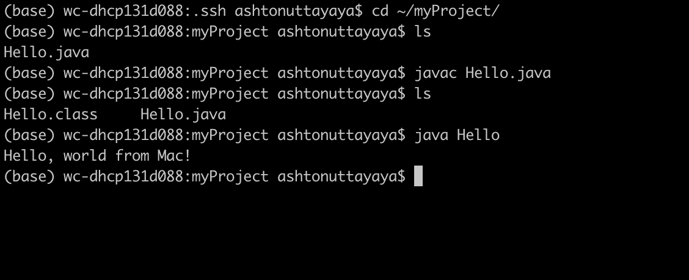
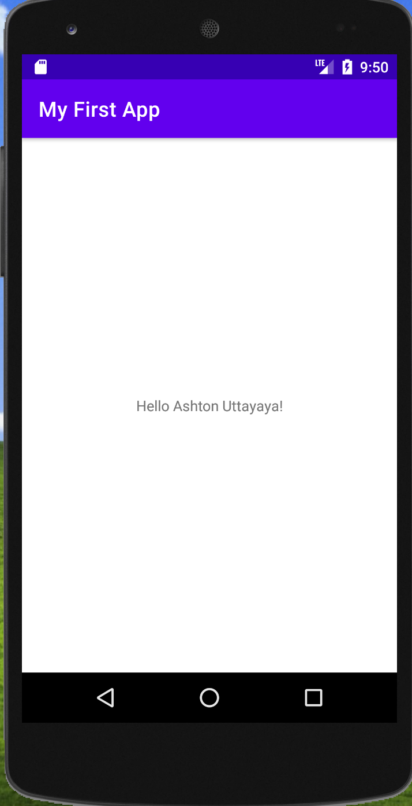
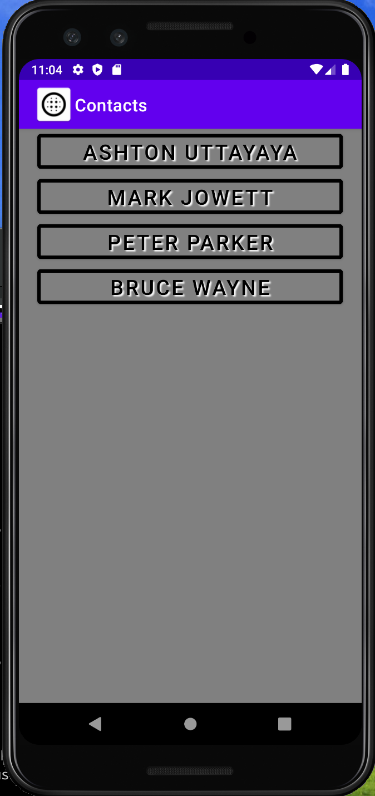
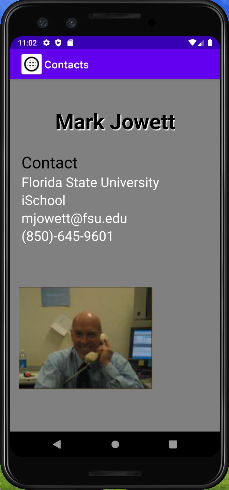
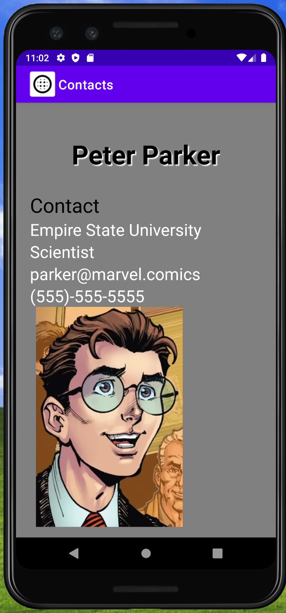
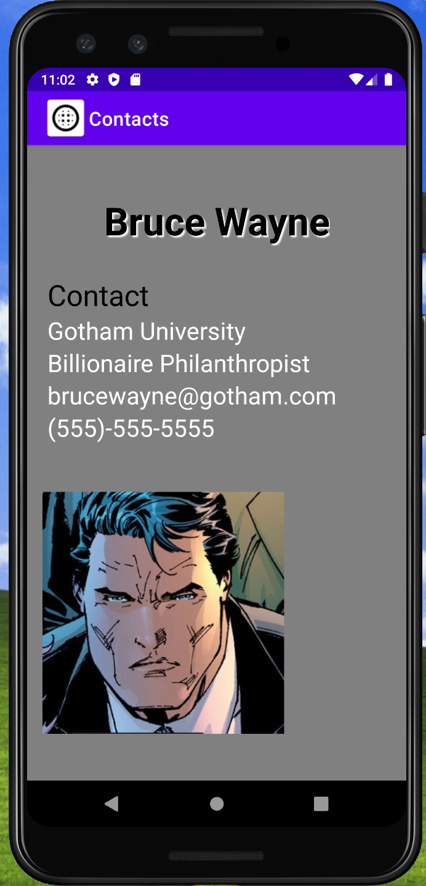

# LIS 4331 - Advanced Mobile Web App Development

## Ashton Uttayaya

### Assignment 1 Requirements:

*Five Parts:*

1. Creating Java Hello World!
2. Creating Contacts App
3. Creating My First App
4. Git commands and descriptions
5. Bitbucket stations locations screenshot

#### README.md file should include the following items:

* Screenshot of running java Hello
* Screenshot of running My First App
* Screemshot of running Contacts App
* Git Commands with short description
* Bitbuckt repo links: a) [this assignment](https://bitbucket.org/aru19b/lis4381/src/master/) and b) [the completed tutorials](https://bitbucket.org/aru19b/bitbucketstationlocations/src/master/)
 
> #### Git commands w/short descriptions:

1. git init - Creates empty git repo in specified directory, runs with no arguments to initialize current directory as git repo
2. git status - list all staged, unstaged, and untracked files
3. git add - stages specified changes for next commit
4. git commit - commits version being pushed with specified message
5. git push - pushes local branches to remote repository
6. git pull - pulls all changes made on remote repository to local repository
7. git diff - shows unstaged changes between local and remote repository

#### Assignment Screenshots:

#### *Screenshot of running java Hello*:

#### *Screenshot of Android Studio - My First App*:

#### *Screenshot of Contacts App*:
Home Page                 | Contact               |
:-------------------------:|:-------------------------:|
 |  |

#### *Screenshot of Contacts App (Three other contacts)*:
Mark Jowett                | Peter Parker              | Bruce Wayne              |
:-------------------------:|:-------------------------:|:-------------------------:
 |  | 

#### Tutorial Links:

*Bitbucket Tutorial - Station Locations:*
[A1 Bitbucket Station Locations Tutorial Link](https://bitbucket.org/aru19b/bitbucketstationlocations/ "Bitbucket Station Locations")

