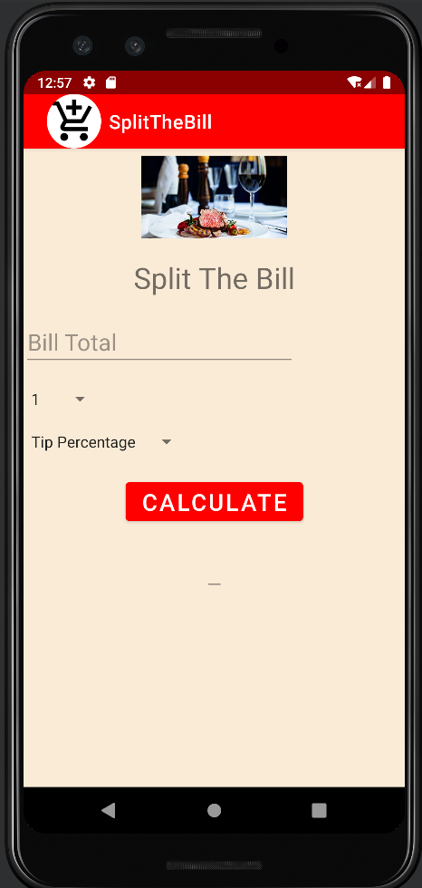
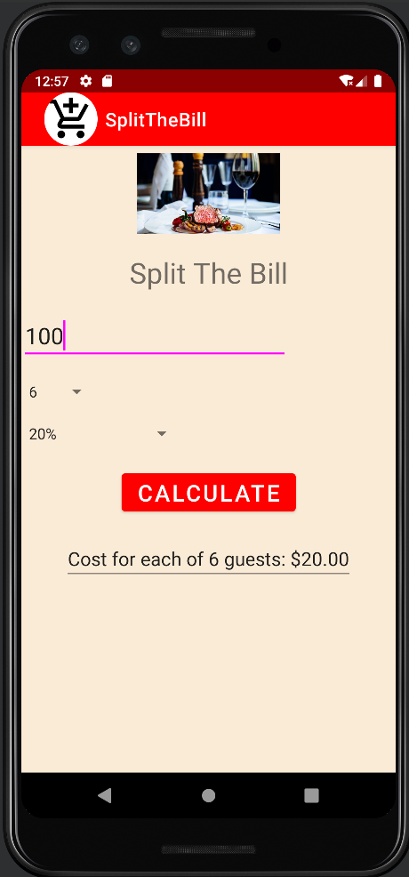
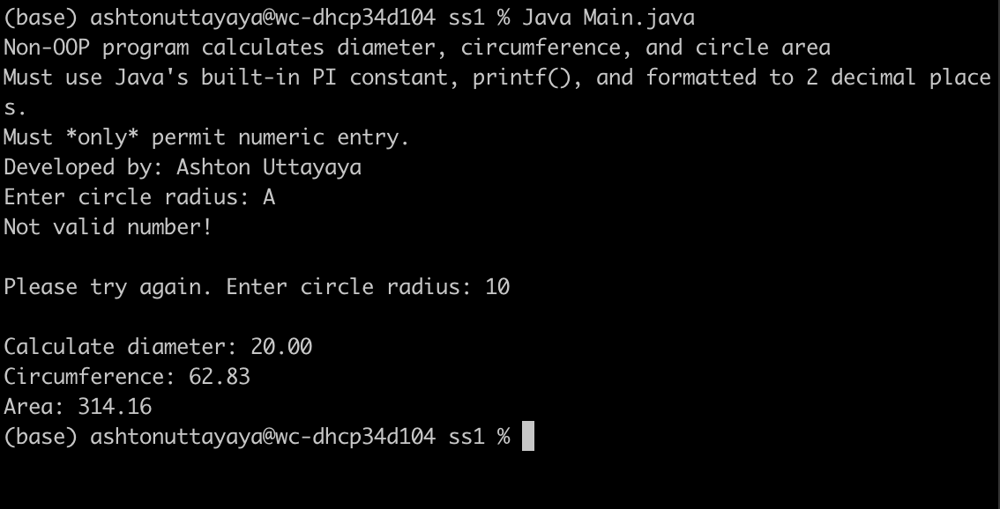
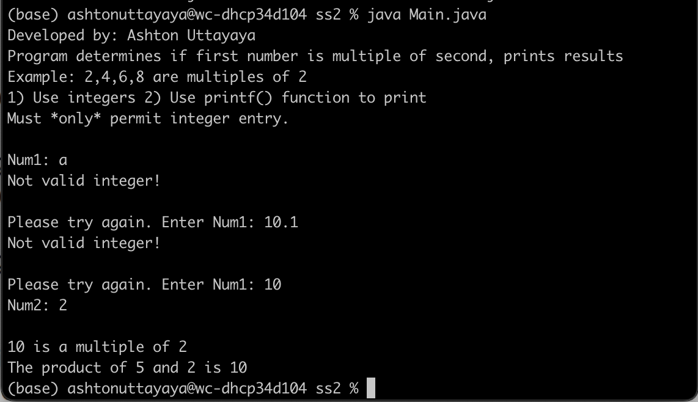
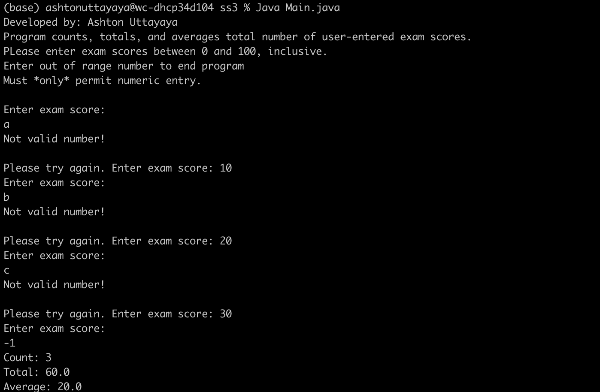

# LIS 4331 - Advanced Mobile Web App Development

## Ashton Uttayaya

### Assignment 2 Requirements:

*Two Parts:*

1. Create a tip calculator app using android studio
2. Skill sets 1-3

#### README.md file should include the following items:

* Screenshot of running application's home page
* Screenshot of running application's tip calculator

#### Assignment Screenshots:

#### *Screenshots of running both application's user interfaces.*:

Screen 1                   |  Screen 2
:-------------------------:|:-------------------------:
  |  

#### *Screenshots of Skill Sets.:
Skill Set 1                |  Skill Set 2              | Skill Set 3
:-------------------------:|:-------------------------:|:-------------------------:
 |   | 