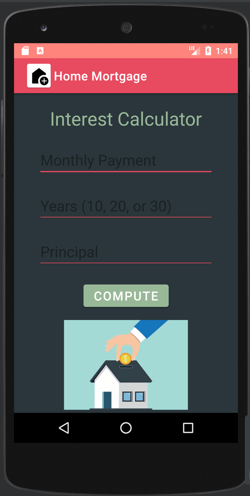
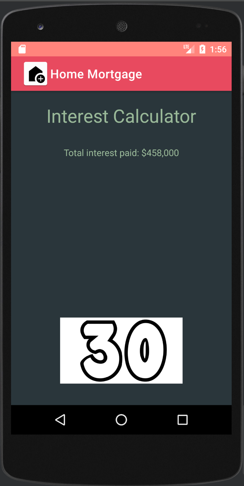
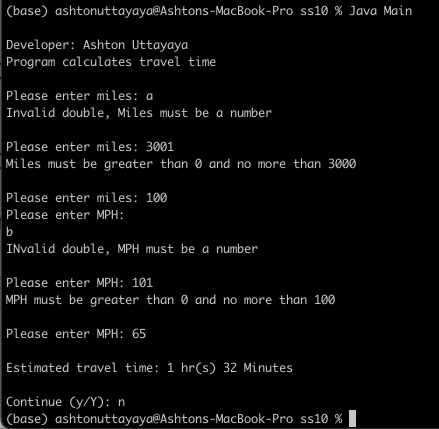
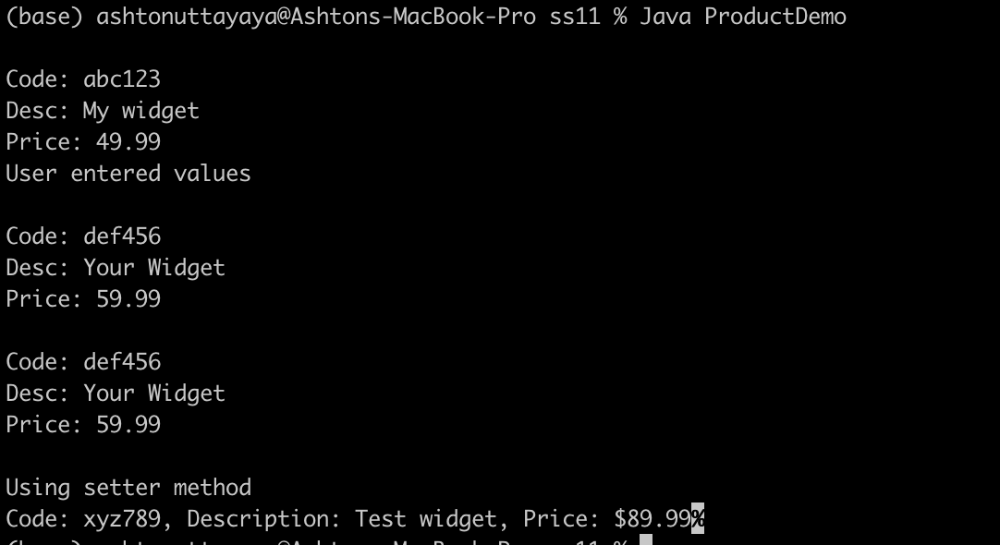
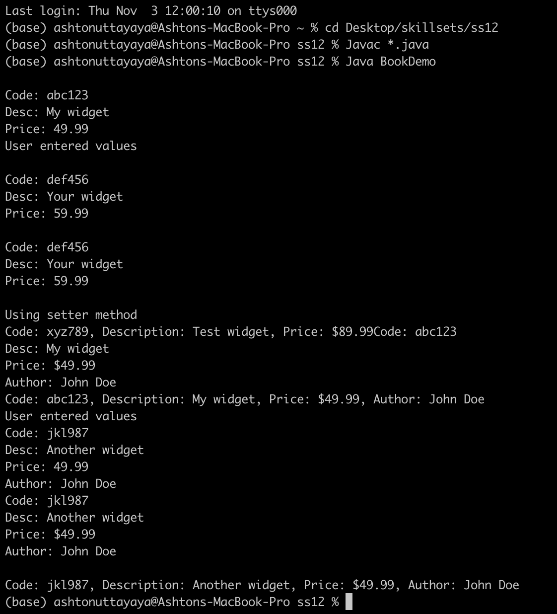

# LIS 4331 - Advanced Mobile Web App Development

## Ashton Uttayaya

### Assignment 4 Requirements:

*Three Parts:*

1. Create Home mortgage interest calculator app
2. Use shared preferences to store and retrieve data between classes
3. Skill sets 10 through 12

#### README.md file should include the following items:

* Screenshot of app splash screen
* Screenshot of app home page
* Screenshot of invalid data input
* Screenshot of valid data input
* Screenshot of skill sets

#### Assignment Screenshots:

#### *Screenshots of Skill Sets.:

Splash Screen              | Main Screen
:-------------------------:|:-------------------------:
 | 

#### *Screenshot of valid and invalid data inputs.:

Valid data                 | Invalid data
:-------------------------:|:-------------------------:
 | 

#### *Screenshots of Skill Sets.:

Skill Set 10                |
:-------------------------:|
 |

Skill Set 11                |
:-------------------------:|
 |

Skill Set 12                |
:-------------------------:|
 |