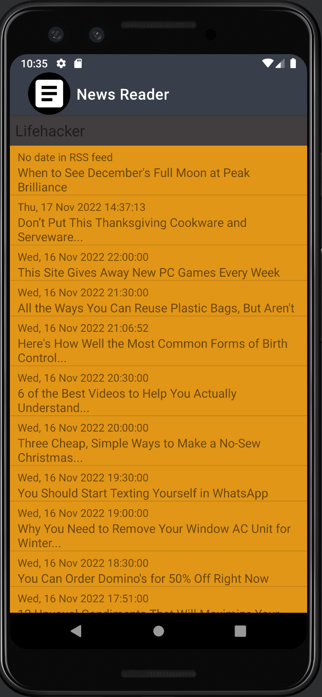
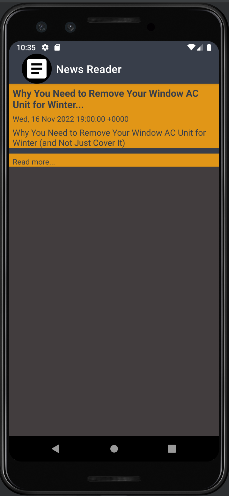
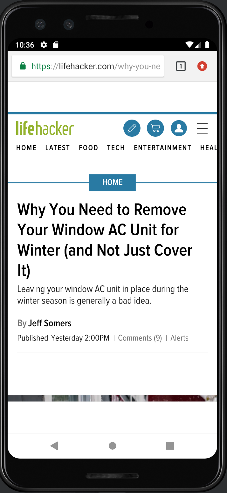
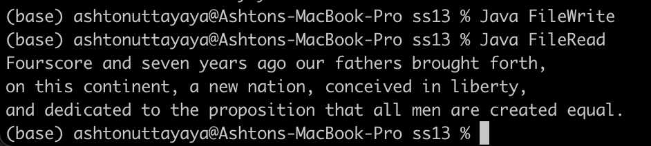
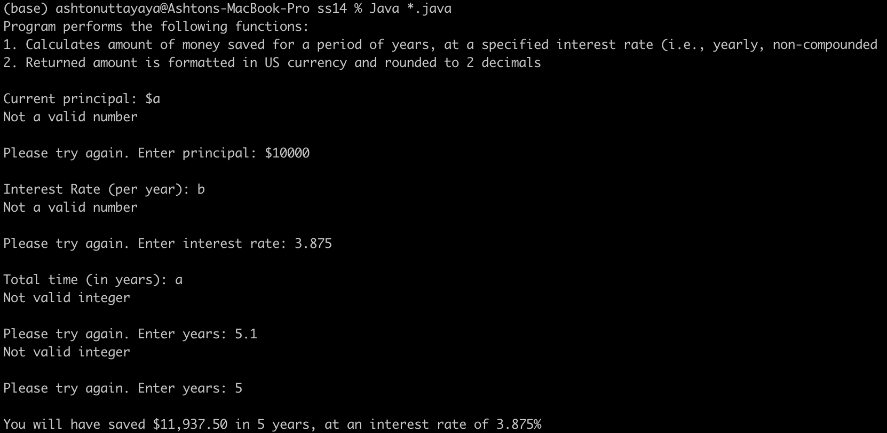
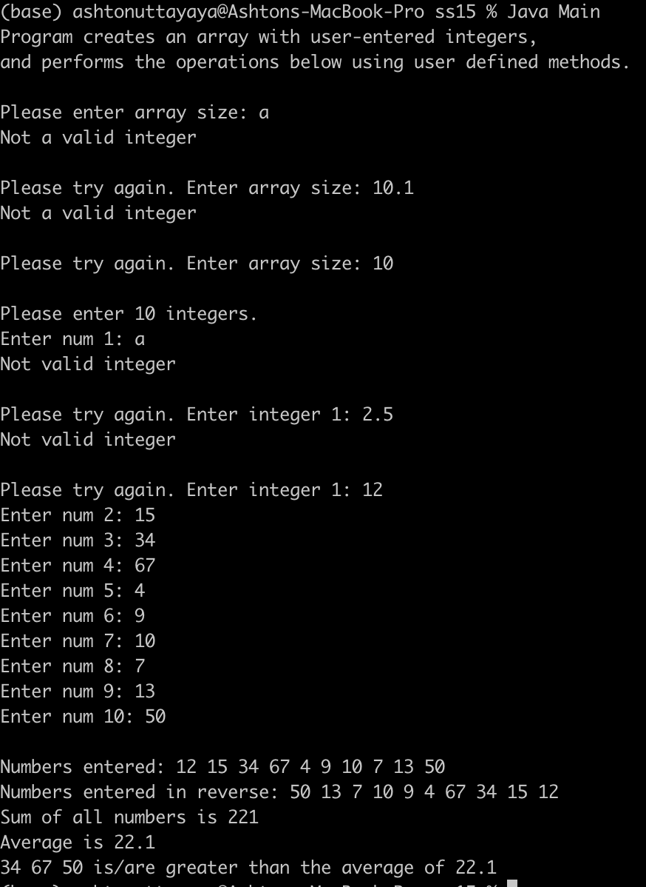

# LIS 4331 - Advanced Mobile Web App Development

## Ashton Uttayaya

### Assignment 5 Requirements:

*Three Parts:*

1. Create an RSS feed app
2. Activities use scroll view
3. Skill sets 13 through 15

#### README.md file should include the following items:

* Screenshot of Home Page
* Screenshot of running application’s individual article
* Screenshot of running link from RSS feed
* Screenshot of skill sets

#### Assignment Screenshots:

#### *Screenshots of Homescreen.:

Home Screen              |
:-------------------------:|
 |

#### *Screenshot of individual article and browser opening.:

Individual                 | Browser               |
:-------------------------:|:-------------------------:|
 |  |

#### *Screenshots of Skill Sets.:

Skill Set 13                |
:-------------------------:|
 |

Skill Set 14               | 
:-------------------------:|
 |

Skill Set 15               |
:-------------------------:|
 | 