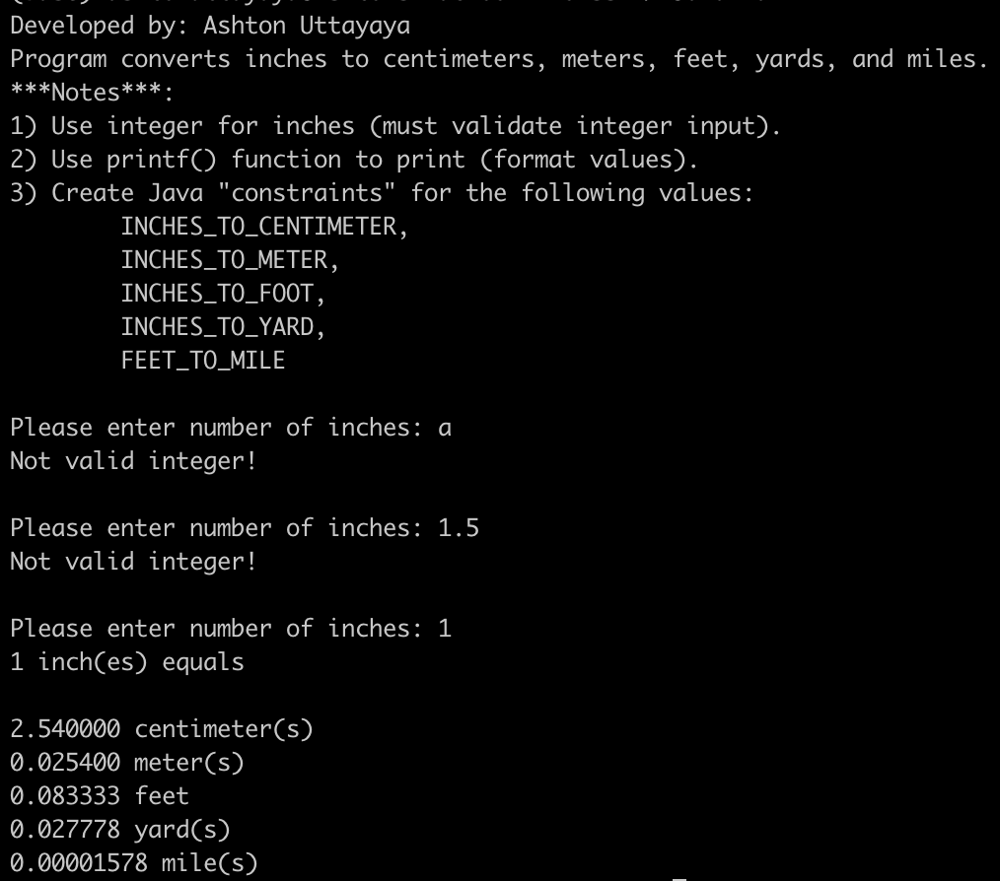

# LIS 4331 - Advanced Mobile Web App Development

## Ashton Uttayaya

### Project 1 Requirements:

*Six Parts:*

1. Include splash screen image, app title, intro text.
2. Include artists? images and media.
3. Images and buttons must be vertically and horizontally aligned.
4. Must add background color(s) or theme
5. Create and display launcher icon image
6. Skill Sets 7-9

#### README.md file should include the following items:

* Video of the app running showcasing the following things
- The apps slpash screen
- The apps landing page
- The apps state when playing music
- The apps state when the music is paused

* Screenshot of skill sets

#### Assignment Screenshots/Videos:

#### *Video of the app running and its funtions.*:

[Video](https://youtube.com/shorts/aDbbTdgUYW4)

#### *Screenshots of Skill Sets.:

Skill Set 7(1)             | Skill Set 7(2)
:-------------------------:|:-------------------------:
 | 

Skill Set 8(1)             | Skill Set 8(2)
:-------------------------:|:-------------------------:
 | 

Skill Set 9(1)             | Skill Set 9(2)            | Skill Set 9(3)
:-------------------------:|:-------------------------:|:-------------------------:
 |  |  |
