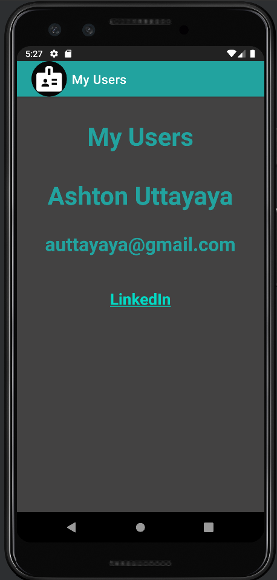
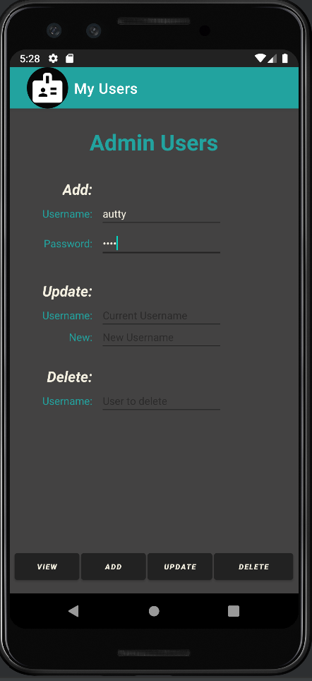
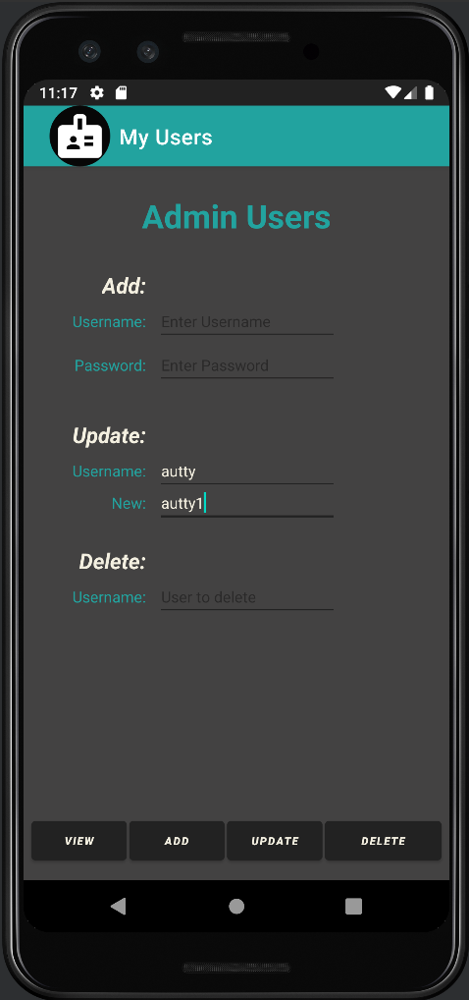
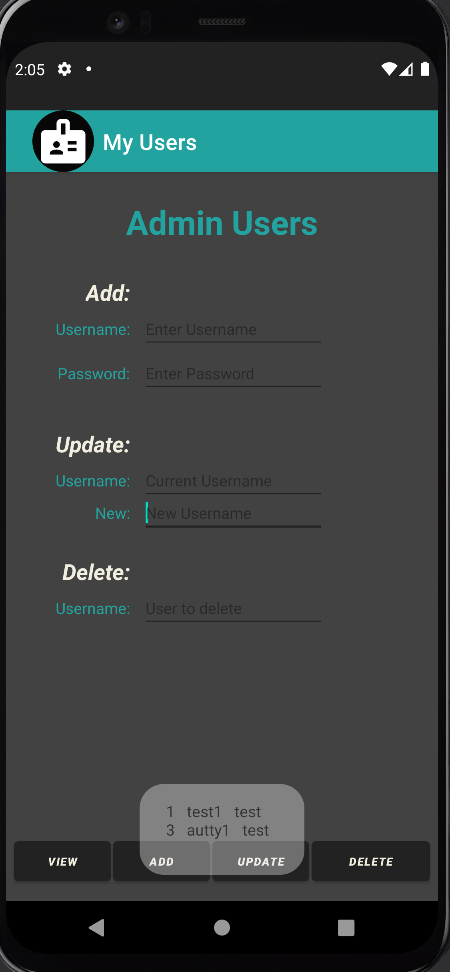
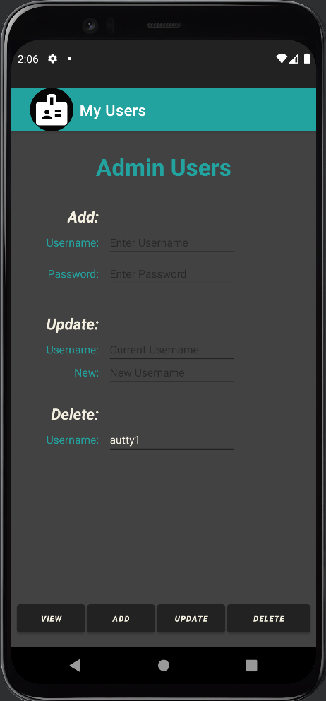

# LIS 4381 - Mobile Web App Development

## Ashton Uttayaya

### Project 2 Requirements:

*Three Parts:*

1. Include splash screen. 
2. Must use persistent data: SQLite database. 
3. Insert at least five users. 
4. Must add background color(s) or theme. 
5. Create and display launcher icon image. 

#### README.md file should include the following items:

* Screenshot of app splash
* Screenshot of add user
* Screenshot of update user
* Screenshot of view user
* Screenshot of delete user

#### Assignment Screenshots:

#### *Screenshots of home page.:

App Splash                 | Add User
:-------------------------:|:-------------------------:|
        | 

Update User                | View User
:-------------------------:|:-------------------------:|
        |  

Delete User                |
:-------------------------:|
         |

